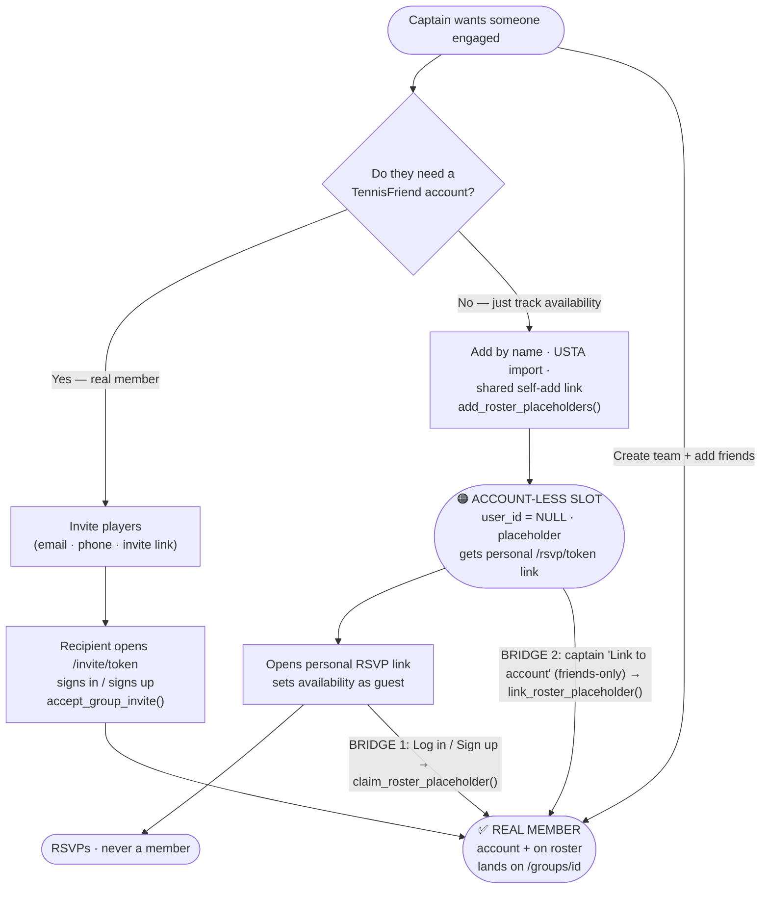
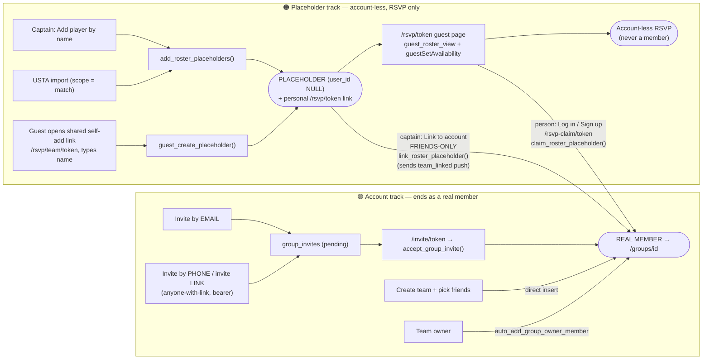

# How people get onto a team

Every roster row is a `group_members` row. It's in exactly one of two states:

- **Real member** — `user_id` set (a TennisFriend account).
- **Account-less placeholder** — `user_id = NULL`, has a `placeholder_name` + a
  `claim_token` (a personal `/rsvp/{token}` RSVP link). Not a member; just a tracked name.

The confusion this doc exists to clear up: several captain tools *feel* like "inviting to
the app" but actually create **placeholders** (RSVP-only), while only the email/phone
invite creates a **real member**.

## 1. Big picture — two tracks + two bridges

## 2. Detailed — every entry point

## 3. Path summary

| Path | Entry (route / UI) | Creates | Intermediate | End state |
|---|---|---|---|---|
| Email invite | Settings → Invite players → email | `group_invites` | pending invite | **Real member** on accept |
| Phone / invite link | Settings → Invite players → phone / share link | `group_invites` (no email) | pending invite | **Real member** on accept |
| Create team + friends | `/groups` create form | `group_members` (user_id) | — | **Real member** immediately |
| Add player by name | Availability → *(InvitePlayersPanel)* | `add_roster_placeholders` | placeholder | Account-less RSVP |
| Personal RSVP link | share a placeholder's `/rsvp/token` | (link only) | placeholder | Account-less RSVP |
| Shared self-add link | `/rsvp/team/token` → guest types name | `guest_create_placeholder` | placeholder | Account-less RSVP |
| USTA import | Availability → Import USTA | `add_roster_placeholders` (match) | placeholder | Account-less RSVP |
| **Bridge 1: self-claim** | `/rsvp/token` → log in / sign up → `/rsvp-claim/token` | `claim_roster_placeholder` | placeholder → | **Real member** (RSVPs carry over) |
| **Bridge 2: captain link** | roster / availability badge → Link to account | `link_roster_placeholder` (friends-only) | placeholder → | **Real member** |

## 4. Why it's confusing (the overlaps to fix later)

- **"Invite" ambiguity:** email/phone invite → real member; but Add-by-name / personal
  links / shared self-add link → account-less placeholder. Both read as "inviting."
  *(Partly addressed already: the account-less tools were relabeled RSVP-only and moved
  off the Settings "Invite" area.)*
- **Two ways to become a member from a placeholder** (self-claim vs captain-link), and
  captain-link is **friends-only** — so a non-friend on the app can only self-claim.
  *(Bridge 1 self-claim was just added to close that gap.)*
- **Shared self-add link has no dedup** → repeated submits stack duplicate placeholders
  (root cause of the Love Hurts 1 mess).

## 5. Notable gaps / out of scope

- **No browse / request-to-join for teams.** `/groups` shows only teams you're already in;
  there's no public discovery or "ask to join." (The `join_request` notification is for
  pickup games / `play_requests`, not teams.)
- **Club invites are a separate system** (`friend_groups`, `/club-invite/token`,
  `accept_club_invite_link`) — not covered here.

---

### Key routes & RPCs (for reference)

- Routes: `/invite/[token]`, `/rsvp/[token]`, `/rsvp/team/[groupToken]`, `/rsvp-claim/[token]`
- RPCs (`supabase/schema.sql`): `accept_group_invite`, `add_roster_placeholders`,
  `mint_roster_link`, `guest_create_placeholder`, `claim_roster_placeholder`,
  `link_roster_placeholder`
